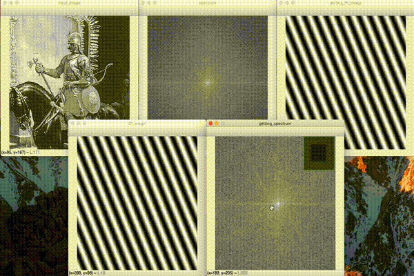

# Fourier-transform-by-python
# 説明
　VideoCaputureクラスでカメラ画像を取得し、フレーム毎の輝度の平均値を計算し、matplotlibのFuncAnimationを用いて、動的にグラフにプロットする。
jupyter notebook上で実行を行った。
次のgifは実際に実行した様子である。

 
 
# 環境
Python: Python 3.7.3  
OpenCV: 4.1.0  
Anaconda: conda 4.6.10  

# 参考
http://labs.eecs.tottori-u.ac.jp/sd/Member/oyamada/OpenCV/html/py_tutorials/py_imgproc/py_transforms/py_fourier_transform/py_fourier_transform.html

http://whitecat-student.hatenablog.com/entry/2016/11/09/225631

http://rasp.hateblo.jp/entry/2016/01/24/204539

https://code-graffiti.com/opencv-direct-drawing-with-a-mouse-in-python/
